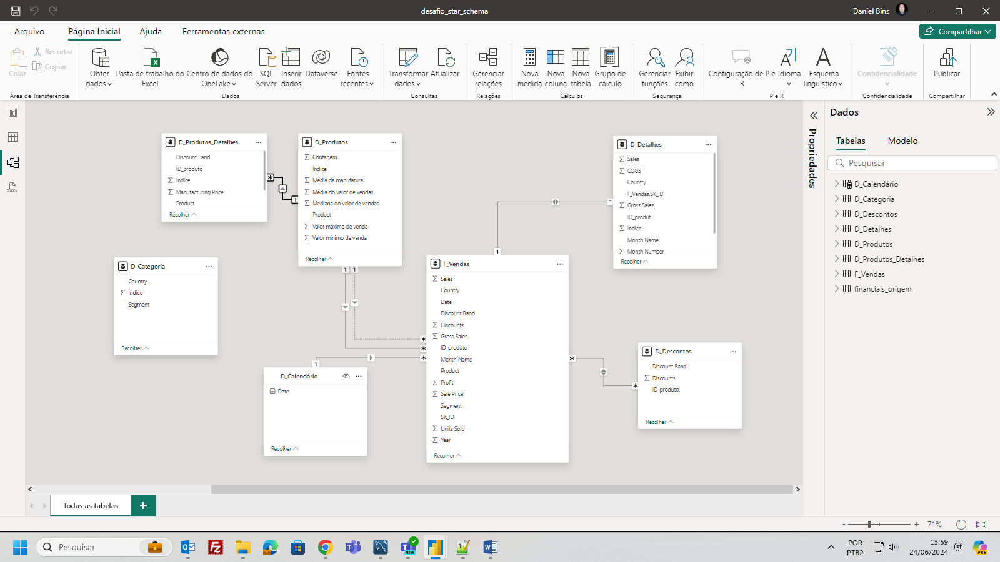

# Desafio Power BI - Módulo 5 DIO - Star Schema

No desafio "Modelando um Dashboard de E-commerce com Power BI Utilizando Fórmulas DAX" do módulo de Modelagem de Dados com Power Bi do Bootcamp "Data Analytics com Power BI" foi proposta a modelagem de dados no formato Star Schema de uma base de dados fornecida pelo curso. Foi criada também uma tabela calendário utilizando DAX

A modelagem ficou da seguinte forma:

Neste repositório se encontra o arquivo do Power Bi com a modelagem feita no formato proposto  e o arquivo com a base de dados original.
